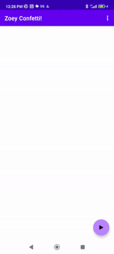

# ZoeyLottieTest
 A quick test app with lottie in native android for Zoey & crew.
 
 
 
## To build:
 Check out the repo. Open as project with Android Studio. Press build. Send build to a device or virtual machine.
 
## To test right now:
 Download the APK in the .apk folder. Install on a virtual machine or device.
 
## Animate
Press the floating play button to see animation. It will call AnimationView.playAnimation() in FirstFragment. See the layout.xml of the fragment on how to place this view.

## More information
Lottie itself has excellent documentation, see:
https://github.com/airbnb/lottie-android

## Reuse
I give you permission to re-use the parts of this project that I added for whatever purpose, besides harmful things.
